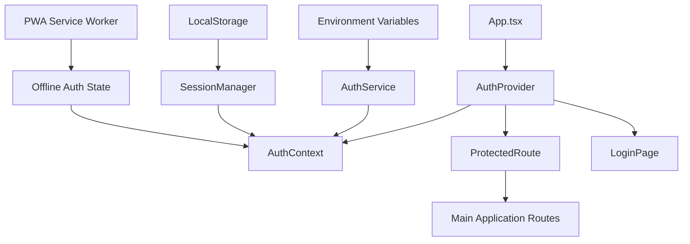

# Authentication Layer Design Document

## Overview

The authentication system will be implemented as a React context-based solution that wraps the entire application, providing secure access control while maintaining excellent user experience for both web and PWA usage. The system uses environment variables for credential validation and localStorage for persistent sessions on mobile devices.

## Architecture

### High-Level Architecture



### Component Hierarchy

1. **AuthProvider**: Top-level context provider that manages authentication state
2. **AuthContext**: React context for sharing auth state across components
3. **ProtectedRoute**: Route wrapper that enforces authentication
4. **LoginPage**: Dedicated login interface
5. **AuthService**: Service layer for credential validation
6. **SessionManager**: Handles persistent storage and session management

## Components and Interfaces

### AuthContext Interface

```typescript
interface AuthContextType {
  isAuthenticated: boolean;
  isLoading: boolean;
  user: User | null;
  login: (username: string, password: string, rememberMe?: boolean) => Promise<boolean>;
  logout: () => void;
  error: string | null;
}

interface User {
  username: string;
  loginTime: Date;
}
```

### AuthProvider Component

- Wraps the entire application in App.tsx
- Manages global authentication state
- Provides authentication methods to child components
- Handles session restoration on app startup
- Manages loading states during authentication

### ProtectedRoute Component

- Higher-order component that wraps existing routes
- Redirects unauthenticated users to login page
- Preserves intended destination for post-login redirect
- Handles authentication state changes gracefully

### LoginPage Component

- Clean, responsive login form using existing shadcn/ui components
- Username and password input fields
- "Remember me" checkbox for persistent login
- Error message display
- Loading states during authentication
- Mobile-optimized design for PWA usage

### AuthService

- Validates credentials against environment variables
- Handles credential hashing/comparison securely
- Manages authentication tokens/sessions
- Provides secure logout functionality

### SessionManager

- Handles localStorage operations for persistent sessions
- Manages session expiration
- Provides secure credential storage for mobile devices
- Handles session cleanup on logout

## Data Models

### Authentication State

```typescript
interface AuthState {
  isAuthenticated: boolean;
  isLoading: boolean;
  user: User | null;
  error: string | null;
  sessionExpiry: Date | null;
}
```

### Stored Session Data

```typescript
interface StoredSession {
  username: string;
  hashedCredentials: string;
  loginTime: string;
  expiryTime: string;
  rememberMe: boolean;
}
```

### Environment Configuration

```typescript
interface AuthConfig {
  VITE_AUTH_USERNAME: string;
  VITE_AUTH_PASSWORD_HASH: string;
  VITE_SESSION_DURATION: string; // in hours
}
```

## Error Handling

### Authentication Errors

1. **Invalid Credentials**: Clear error message without revealing which field is incorrect
2. **Network Errors**: Graceful handling with retry options
3. **Session Expiry**: Automatic redirect to login with session expired message
4. **Storage Errors**: Fallback to session-only authentication

### Error Recovery

- Automatic retry for transient network issues
- Graceful degradation when localStorage is unavailable
- Clear error messages with actionable guidance
- Fallback authentication flow for edge cases

## Testing Strategy

### Unit Tests

- AuthContext state management
- AuthService credential validation
- SessionManager storage operations
- Component rendering with different auth states

### Integration Tests

- Complete login/logout flow
- Route protection enforcement
- Session persistence across app restarts
- PWA authentication behavior

### E2E Tests

- Full user authentication journey
- Mobile PWA installation and login
- Session management across browser sessions
- Error handling scenarios

## Security Considerations

### Credential Storage

- Environment variables for server-side credential validation
- No hardcoded credentials in source code
- Secure hashing for stored session data
- Automatic session cleanup on logout

### Session Management

- Configurable session expiration
- Secure localStorage usage with encryption
- Session invalidation on security events
- Protection against XSS and CSRF attacks

### PWA Security

- Service worker authentication state synchronization
- Secure offline authentication handling
- Protected credential storage in mobile browsers
- Automatic session validation on app focus

## Implementation Phases

### Phase 1: Core Authentication
- AuthContext and AuthProvider setup
- Basic login/logout functionality
- Environment variable configuration
- Route protection implementation

### Phase 2: Session Management
- Persistent login functionality
- SessionManager implementation
- Mobile-optimized storage
- Session expiration handling

### Phase 3: PWA Integration
- Service worker authentication sync
- Offline authentication state
- Mobile app optimization
- Cross-session state management

### Phase 4: Enhanced UX
- Loading states and transitions
- Error handling improvements
- Remember me functionality
- Session extension prompts